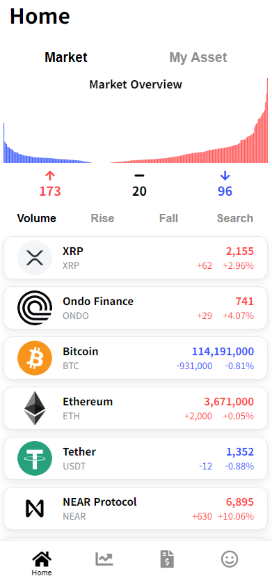

# CoinTrade v2



Crypto Coin paper trading service. 

You can visit [Hosted Page](https://coin-trade-psi.vercel.app/)!

API from [UpBit](https://docs.upbit.com/).

## Development & Run

```sh
# 패키지 설치
npm i --legacy-peer-deps

# 개발 서버 실행 (Next.js + WebSocket Proxy 커스텀 서버)
npm run dev

# 프로덕션 빌드 및 실행
npm run build
npm start
```

## Tech

- Next.js (Pages Router + Custom Server)
- Node.js WebSocket Server (`ws`)
- React 18
- TypeScript
- WS
- Redux
- SCSS
- Chart.js
- Big.js
- CryptoJS

## To do

- [x] Control DOM with state
- [x] Needs Number modules to calculate decimal correctly - Big.js
- [x] Remove any type
- [x] code spliting

## Doing

- [ ] Structure Optimization
